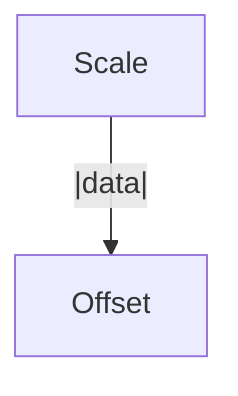
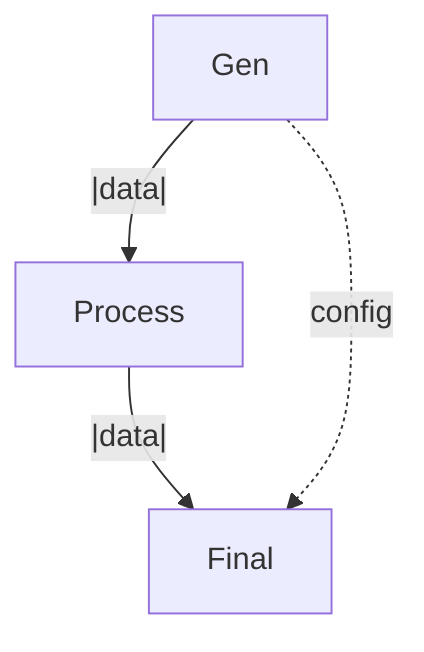
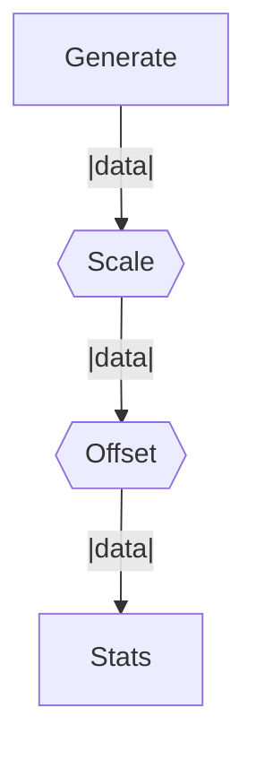
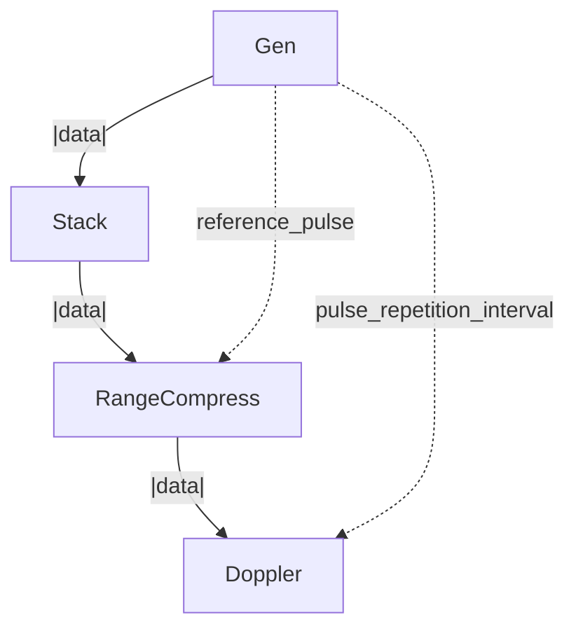

# sigexec

Signal processing execution graphs with efficient port-based data flow.

[](https://sigexec.github.io/sigexec/)

## Features

- **Efficient Execution**: Static analysis determines optimal port routing - operations receive only the data they need
- **Flow Visualization**: Automatic mermaid diagrams showing data flow including bypass connections
- **Dataclass Blocks**: Type-safe, reusable processing blocks using Python dataclasses
- **Parameter Variants**: Explore parameter spaces with automatic execution graph generation
- **Port Optimization**: Automatic detection of which metadata ports each operation uses

## Installation

```bash
pip install sigexec
```

Or from source:

```bash
git clone https://github.com/briday1/sigexec.git
cd sigexec
pip install -e .
```

## Quick Example

```python
from sigexec import Graph, GraphData
import numpy as np

# Create a simple processing graph
graph = Graph("Processing")

graph.add(lambda g: GraphData(g.data * 2, metadata=g.metadata), name="Scale")
graph.add(lambda g: GraphData(g.data + 10, metadata=g.metadata), name="Offset")

result = graph.run(GraphData(np.array([1.0, 2.0, 3.0])))
print(result.data)  # [12. 14. 16.]

# Visualize the flow
print(graph.to_mermaid())
```

**Output:**


## Dataclass Blocks

Create reusable processing blocks as dataclasses:

```python
from dataclasses import dataclass
from sigexec import Graph, GraphData
import numpy as np

@dataclass
class Scaler:
    factor: float = 2.0
    
    def __call__(self, gdata: GraphData) -> GraphData:
        return GraphData(
            gdata.data * self.factor,
            metadata={**gdata.metadata, 'scaled_by': self.factor}
        )

@dataclass
class Filter:
    cutoff: float = 0.5
    
    def __call__(self, gdata: GraphData) -> GraphData:
        # Apply your filtering logic
        filtered = gdata.data * (1.0 - self.cutoff)
        return GraphData(filtered, metadata=gdata.metadata)

# Use them in a graph
graph = Graph("MyPipeline")
graph.add(Scaler(factor=3.0), name="Scale")
graph.add(Filter(cutoff=0.2), name="Filter")

result = graph.run(GraphData(np.array([1.0, 2.0, 3.0])))
```

## Port Bypass Optimization

Operations automatically bypass intermediate steps when they don't need specific ports:

```python
from sigexec import Graph, GraphData
import numpy as np

def generator(gdata):
    """Produces multiple outputs"""
    return GraphData(
        gdata.data * 2,
        metadata={
            'config': {'mode': 'fast'},
            'timestamp': 12345
        }
    )

def processor(gdata):
    """Only uses 'data' - doesn't touch config or timestamp"""
    return GraphData(gdata.data + 10, metadata=gdata.metadata)

def finalizer(gdata):
    """Uses data AND the original config (which bypasses processor)"""
    config = gdata.metadata.get('config', {})
    mode = config.get('mode', 'unknown')
    result = gdata.data * 3 if mode == 'fast' else gdata.data
    return GraphData(result, metadata=gdata.metadata)

graph = Graph("PortBypass")
graph.add(generator, name="Gen")
graph.add(processor, name="Process")
graph.add(finalizer, name="Final")

print(graph.to_mermaid())
```

**Output shows bypass connection (dotted line):**


The `config` port flows directly from Gen→Final, bypassing Process entirely!

## Parameter Variants

Explore parameter spaces with automatic visualization:

```python
from sigexec import Graph, GraphData
import numpy as np

def make_scaler(factor):
    return lambda g: GraphData(g.data * factor, metadata=g.metadata)

def make_offsetter(amount):
    return lambda g: GraphData(g.data + amount, metadata=g.metadata)

graph = Graph("Variants")
graph.add(lambda g: GraphData(np.array([1.0, 2.0, 3.0]), metadata=g.metadata), name="Generate")
graph.variant(make_scaler, [2.0, 3.0, 5.0], name='Scale')
graph.variant(make_offsetter, [10.0, 20.0], name='Offset')
graph.add(lambda g: GraphData(g.data, metadata={
    **g.metadata, 
    'mean': float(np.mean(g.data))
}), name="Stats")

print(graph.to_mermaid())
```


**Hexagons indicate operations with variants:**


The graph executes all combinations: 3 scale factors × 2 offsets = 6 total executions.

## Radar Processing Example

The included radar processing blocks demonstrate a complete application:

```python
from sigexec import Graph
from sigexec.blocks import LFMGenerator, StackPulses, RangeCompress, DopplerCompress

graph = (Graph("Radar Processing")
    .add(LFMGenerator(num_pulses=128, target_delay=20e-6, target_doppler=1000.0), name="Gen")
    .add(StackPulses(), name="Stack")
    .add(RangeCompress(window='hamming', oversample_factor=2), name="RangeCompress")
    .add(DopplerCompress(), name="Doppler"))

result = graph.run()
range_doppler_map = result.data

print(graph.to_mermaid())
```

**Execution graph showing efficient port routing:**


Notice how `reference_pulse` and `pulse_repetition_interval` bypass operations that don't need them!

## Creating Custom Blocks

Blocks are just dataclasses with `__call__` methods:

```python
from dataclasses import dataclass
from sigexec import GraphData
import numpy as np

@dataclass
class MyProcessor:
    """Your custom processing block"""
    param1: float = 1.0
    param2: str = "default"
    
    def __call__(self, gdata: GraphData) -> GraphData:
        # Read input data
        input_data = gdata.data
        
        # Access metadata if needed
        config = gdata.metadata.get('config', {})
        
        # Process
        output_data = input_data * self.param1
        
        # Return new GraphData with results
        return GraphData(
            output_data,
            metadata={
                **gdata.metadata,
                'processed_with': self.param2
            }
        )
```

That's it! Use it in any graph:

```python
graph = Graph("Custom")
graph.add(MyProcessor(param1=2.5, param2="advanced"), name="MyBlock")
```

## Documentation

- **Live Demos**: [https://sigexec.github.io/sigexec/](https://sigexec.github.io/sigexec/)
- **Examples**: Check the `examples/` directory
- **Tests**: See `tests/` for comprehensive usage examples

## Key Concepts

### GraphData
The standard data container that flows through operations. Has:
- `data`: numpy array (the main signal/data)
- `metadata`: dict of additional named ports (configs, timestamps, reference signals, etc.)

### Ports
Named data fields in metadata. Operations declare which ports they use via:
- Static analysis (AST inspection of function code)
- Runtime detection (observing metadata access patterns)

This enables automatic optimization - ports flow directly from producer to consumer, bypassing intermediate operations.

### Visualization
- Solid lines (`-->`) show direct flow between adjacent operations
- Dotted lines (`-.->`) show bypass connections where ports skip operations
- Rectangles `[Name]` show regular operations
- Hexagons `{{Name}}` show operations with parameter variants

## Requirements

- Python >= 3.7
- numpy >= 1.20.0
- scipy >= 1.7.0
- matplotlib >= 3.3.0
- plotly >= 5.0.0

## License

MIT License - see LICENSE file for details.

## Contributing

Contributions welcome! Please feel free to submit a Pull Request.
