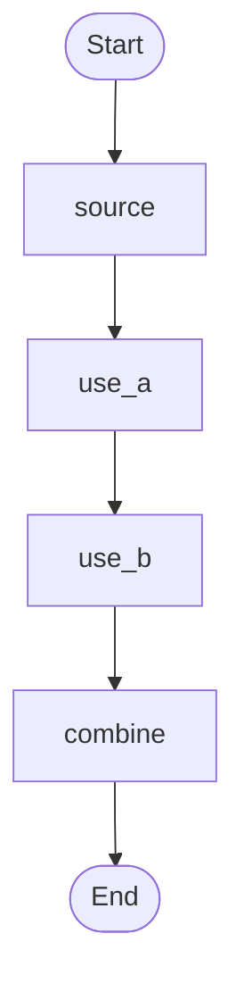

# SigExec - Signal Processing Chain Framework

A Python framework for building signal processing graphs with port-based data flow and parameter exploration.

**SigExec provides the framework - you bring the blocks!** The included radar processing blocks are examples showing how to use the framework. You can easily create your own custom blocks for any signal processing application.

## Quick Links

- **GitHub Pages** - [https://sigexec.github.io/sigexec/](https://sigexec.github.io/sigexec/)

## Features

- **Port-Based Data Flow**: Natural data flow through named ports - operations read/write exactly what they need
- **Data Class Blocks**: Type-safe, composable processing blocks using Python dataclasses
- **Parameter Exploration**: Built-in support for exploring parameter combinations with `.variant()`
- **Graph Visualization**: Visualize operation sequences and variant combinations
- **Extensible**: Create custom blocks as simple dataclasses - no complex interfaces required
- **Functional Composition**: Chain operations naturally with consistent input/output types
- **Example Application**: Complete radar processing demonstrating:
  - LFM signal generation with delay and Doppler shift
  - Pulse stacking
  - Matched filtering (range compression)
  - FFT processing (Doppler compression)
  - Range-Doppler map visualization

## Installation

### From Source

```bash
git clone https://github.com/briday1/sigexec.git
cd sigexec
pip install -e .
```

### Requirements

- Python >= 3.7
- numpy >= 1.20.0
- scipy >= 1.7.0
- matplotlib >= 3.3.0

## Quick Start

### Simplest Example - Direct Chaining

The cleanest approach where each block is a configured data class:

```python
from sigexec.blocks import LFMGenerator, StackPulses, RangeCompress, DopplerCompress
### Simplest Example - Direct Chaining

The cleanest approach where each block is a configured data class:

```python
from sigexec.blocks import LFMGenerator, StackPulses, RangeCompress, DopplerCompress

# Configure blocks
gen = LFMGenerator(num_pulses=128, target_delay=20e-6, target_doppler=1000.0)
stack = StackPulses()
range_comp = RangeCompress()
doppler_comp = DopplerCompress(window='hann')

# GraphData object flows through operations
gdata = gen()                    # Generate signal
gdata = stack(gdata)             # Stack pulses
gdata = range_comp(gdata)        # Range compression
gdata = doppler_comp(gdata)      # Doppler compression

# Result is a range-doppler map!
range_doppler_map = gdata.data
```

### Using Graph for Better Organization

```python
from sigexec import Graph
from sigexec.blocks import LFMGenerator, StackPulses, RangeCompress, DopplerCompress

# Build graph with fluent interface
result = (Graph("Radar")
    .add(LFMGenerator(num_pulses=128, target_delay=20e-6, target_doppler=1000.0))
    .add(StackPulses())
    .add(RangeCompress())
    .add(DopplerCompress(window='hann'))
    .run(verbose=True)
)

# Access the range-doppler map
rdm = result.data
```

### Parameter Exploration with Variants

```python
# Explore different window functions
graph = (Graph("Radar")
    .add(LFMGenerator(num_pulses=128))
    .add(StackPulses())
    .add(RangeCompress())
    .variant(lambda w: DopplerCompress(window=w),
             configs=['hann', 'hamming', 'blackman'],
             names=['Hann', 'Hamming', 'Blackman'])
)

# Run all variants
results = graph.run()

# Results is a list of (params, result) tuples
for params, result in results:
    print(f"Window: {params['variant'][0]}")
```

### Branching and Merging

Use branches when you want to run multiple parallel processing paths that may
use identical port names. After processing, use `.merge()` with a custom
merge function to combine branch outputs into a single `GraphData`.

The merge function receives a `BranchesView` (ordered) which supports both
name-based (`branches['name']`) and index-based (`branches[0]`) access so
blocks don't need to know the branch names.

```python
# Example: compare two branches and merge their outputs
from sigexec import Graph, GraphData
from sigexec.blocks import LFMGenerator, StackPulses, RangeCompress, DopplerCompress

def compare_merge(branches):
    # index-based access is convenient and ordered
    a = branches[0].data
    b = branches[1].data

    out = GraphData()
    out.data = np.concatenate([a, b])
    out.set('compared', True)
    return out

graph = (Graph("CompareWindows")
    .add(LFMGenerator())
    .add(StackPulses())
    .add(RangeCompress())
    .branch(['hann', 'hamming'])
    .add(DopplerCompress(window='hann'), branch='hann')
    .add(DopplerCompress(window='hamming'), branch='hamming')
    .merge(compare_merge, branches=['hann', 'hamming'])
)

result = graph.run(GraphData())
print(result.get('compared'))
```


```python
# Explore different window functions
graph = (Graph("Radar")
    .add(LFMGenerator(num_pulses=128))
    .add(StackPulses())
    .add(RangeCompress())
    .variant(lambda w: DopplerCompress(window=w),
             configs=['hann', 'hamming', 'blackman'],
             names=['Hann', 'Hamming', 'Blackman'])
)

# Visualize the graph structure
print(graph.visualize())
# Shows:
#   Graph: Radar
#   1. Op0
#   2. Op1
#   3. Op2
#   4. VARIANT: variants
#      ├─ Hann
#      ├─ Hamming
#      ├─ Blackman
#   Total operations: 4
#   Variant combinations: 3
#   Note: Each variant executes with its own isolated GraphData

# Run all variants
results = graph.run()

# Results is a list of (params, result) tuples
for params, result in results:
    print(f"Window: {params['variant'][0]}")
    # Each result has its own isolated ports
```

### Visualizing Graphs

SigExec can generate Mermaid diagrams to visualize your processing flow **without running it**:

```python
from sigexec import Graph
from sigexec.blocks import LFMGenerator, StackPulses, RangeCompress, DopplerCompress

# Build a graph
graph = (Graph("Radar Processing")
    .add(LFMGenerator(num_pulses=128), name="Generate_LFM")
    .add(StackPulses(), name="Stack_Pulses")
    .add(RangeCompress(), name="Range_Compress")
    .add(DopplerCompress(window='hann'), name="Doppler_Compress"))

# Get Mermaid diagram
print(graph.to_mermaid())

# Or save to file (renders in VS Code, GitHub, etc.)
graph.visualize("radar_flow.md")
```

This generates a flowchart showing the complete processing pipeline with all operations, branches, and merges.

### Inspecting Graphs

**New Feature**: You can inspect the graph structure before running it using the same logic that executes the graph:

```python
# Create sample input for port analysis
sample = GraphData()
sample.data = np.array([1, 2, 3])
sample.sample_rate = 1e6

# Inspect as structured data
info = graph.inspect(sample, format='dict')
print(f"Graph has {len(info['nodes'])} nodes and {len(info['edges'])} edges")

for edge in info['edges']:
    print(f"{edge['from']} -> {edge['to']} (ports: {edge['ports']})")

# Inspect as Mermaid diagram
mermaid = graph.inspect(sample, format='mermaid')
print(mermaid)  # Shows flowchart with port information
```

**Why inspect?**
- **Same logic as execution**: The inspection uses the exact same graph walking logic as `run()`, ensuring what you see is what will execute
- **See before you run**: Understand data flow, branches, and port usage without actually executing operations
- **Debug graph structure**: Verify branches are created correctly and merge points are where you expect

The key difference from `visualize()`: `inspect()` uses the **exact same unified graph walker** as execution, just in inspection mode instead of execution mode. This guarantees the visualization matches actual runtime behavior.

#### Visualizing Branches

```python
graph = (Graph("Branched Processing")
    .add(generate_data, name="Generate")
    .branch(["filter_a", "filter_b"])
    .add(filter_a, branch="filter_a", name="Filter_A")
    .add(filter_b, branch="filter_b", name="Filter_B")
    .merge(merge_fn, branches=["filter_a", "filter_b"], name="Merge"))

# Shows branches as separate paths with dotted lines
graph.visualize("branched_flow.md")
```

#### Visualizing Variants

```python
graph = (Graph("Variant Exploration")
    .add(load_data, name="Load")
    .variant(lambda w: apply_window(w),
             ['hamming', 'hann', 'blackman'],
             names=['Hamming', 'Hann', 'Blackman']))

# Shows variant node with configuration options
graph.visualize("variants_flow.md")
```

### Port Optimization (Default Behavior)

**By default** (`optimize_ports=True`), operations only receive the ports they actually use. Unused ports "bypass" operations entirely, improving memory efficiency and making data flow explicit.

#### Example: Simple Linear Pipeline

Here's a graph that demonstrates port optimization:

```python
from sigexec import Graph, GraphData, requires_ports

# Declare which ports each operation needs
@requires_ports('a')
def use_a(g):
    g.result_a = g.a * 2
    return g

@requires_ports('b')
def use_b(g):
    g.result_b = g.b * 3
    return g

@requires_ports('result_a', 'result_b')
def combine(g):
    g.final = g.result_a + g.result_b
    return g

def source(g):
    g.a = 10
    g.b = 20
    return g

# Create graph
graph = (Graph("Port Demo")
    .add(source, name='source')
    .add(use_a, name='use_a')
    .add(use_b, name='use_b')
    .add(combine, name='combine'))
```

#### Graph Structure

Both optimization modes produce the same graph structure:

````markdown

````


#### Port Flow Behavior

While the graph structure looks the same, the **port flow** differs:

**WITHOUT Port Optimization (`optimize_ports=False`):**
- `source` creates ports `[a, b]`
- `use_a` receives `[a, b]` but only uses `a` ❌ (port `b` unnecessarily copied)
- `use_b` receives `[a, b, result_a]` but only uses `b` ❌ (ports `a`, `result_a` unnecessarily copied)
- `combine` receives all ports ✓

**WITH Port Optimization (`optimize_ports=True` - Default):**
- `source` creates ports `[a, b]`
- `use_a` receives ONLY `[a]` ✓ (port `b` bypasses)
- `use_b` receives ONLY `[b]` ✓ (ports `a`, `result_a` bypass)
- `combine` receives all accumulated ports `[result_a, result_b]` ✓

Run with `verbose=True` to see the actual port flow:

```python
# Without optimization - see all ports copied everywhere
graph_unopt = Graph("Demo", optimize_ports=False).add(source)...
result = graph_unopt.run(GraphData(), verbose=True)

# With optimization (default) - see only needed ports flow
graph_opt = Graph("Demo").add(source)...  # optimize_ports=True by default
result = graph_opt.run(GraphData(), verbose=True)
```

**Benefits of port optimization:**
- ✓ Memory efficient: Only copy ports that are used
- ✓ Explicit data flow: Clear which ports each operation needs  
- ✓ Implicit branching: Operations using different ports naturally create parallel paths
- ✓ Backwards compatible: Set `optimize_ports=False` for old behavior

See [examples/port_optimization_visual_demo.py](examples/port_optimization_visual_demo.py) and [examples/mermaid_port_comparison.py](examples/mermaid_port_comparison.py) for detailed comparisons.

### Running Examples

```bash
# Publish all demos to docs/ (for GitHub Pages)
python examples/publish_demos.py

# Or run individual demos (publishes to staticdash/)
python examples/radar_processing_demo.py
python examples/custom_blocks_demo.py
python examples/parameter_exploration_demo.py
python examples/post_processing_demo.py
python examples/input_variants_demo.py
```

## Architecture

### Core Components

#### GraphData
A data class that wraps signal arrays with metadata:
```python
@dataclass
class GraphData:
    data: np.ndarray          # Signal data
    sample_rate: float        # Sampling rate
    metadata: Dict[str, Any]  # Additional information
```

**Key Point**: Every processing block takes `GraphData` as input and returns `GraphData` as output, enabling clean composition.

#### Data Class Blocks (Recommended)

Modern, clean blocks implemented as dataclasses:

```python
from sigexec.blocks import LFMGenerator, StackPulses, RangeCompress, DopplerCompress

# Configure blocks with parameters
gen = LFMGenerator(num_pulses=128, target_delay=20e-6)
stack = StackPulses()
compress = RangeCompress()

# Call them directly - each returns GraphData
signal = gen()
signal = stack(signal)
signal = compress(signal)
```

Available data class blocks:
- `LFMGenerator` - Generate LFM radar signals
- `StackPulses` - Organize pulses into 2D matrix
- `RangeCompress` - Matched filtering for range compression
- `DopplerCompress` - FFT-based Doppler processing
- `ToMagnitudeDB` - Convert to dB scale
- `Normalize` - Normalize signal data

#### Graph
Manages execution with fluent interface:
```python
graph = (Graph("MyPipeline")
    .add(block1)
    .add(block2)
    .add(block3)
    .run()
)
```

### Processing Blocks

All blocks follow the pattern: `GraphData → Block → GraphData`

#### LFMGenerator
Generates LFM radar signals with configurable parameters:
- Pulse duration and bandwidth
- Target delay and Doppler shift
- Noise characteristics

```python
gen = LFMGenerator(
    num_pulses=128,
    pulse_duration=10e-6,
    bandwidth=5e6,
    target_delay=20e-6,
    target_doppler=1000.0
)
signal = gen()  # Returns GraphData
```

#### StackPulses
Organizes pulses into a 2D matrix for coherent processing.

#### RangeCompress
Performs range compression using matched filtering:
- Correlates received signal with transmitted waveform
- Improves SNR and range resolution

#### DopplerCompress
Performs Doppler compression using FFT:
- FFT along pulse dimension
- Windowing for sidelobe reduction
- Generates Range-Doppler map

## Example Output

The radar examples produce Range-Doppler maps showing:
- **2D visualization**: Range vs Doppler frequency with intensity showing target returns
- **Target detection**: Clear peak at expected range (~3 km) and Doppler (~1 kHz)
- **Noise floor**: Background noise visible across the map

## Project Structure

```
sigexec/
├── sigexec/
│   ├── __init__.py
│   ├── core/
│   │   ├── __init__.py
│   │   ├── data.py          # GraphData class
│   │   └── graph.py      # Graph with fluent interface
│   └── blocks/
│       ├── __init__.py
│       └── functional.py    # Functional processing blocks
├── examples/
│   ├── radar_processing_demo.py
│   ├── custom_blocks_demo.py
│   ├── parameter_exploration_demo.py
│   ├── post_processing_demo.py
│   ├── input_variants_demo.py
│   ├── memoization_demo.py
│   └── publish_demos.py
├── tests/
│   └── test_sigexec.py
├── docs/
│   └── [Generated demo pages]
├── pyproject.toml
└── README.md
```

## Usage Patterns

### Pattern 1: Direct Chaining (Cleanest)

```python
# Configure data class blocks
gen = LFMGenerator(num_pulses=128, target_delay=20e-6)
stack = StackPulses()
compress_range = RangeCompress()
compress_doppler = DopplerCompress()

# Single object flows through
signal = gen()
signal = stack(signal)
signal = compress_range(signal)
signal = compress_doppler(signal)
```

### Pattern 2: Graph Builder

```python
result = (Graph("Radar")
    .add(LFMGenerator(num_pulses=128))
    .add(StackPulses())
    .add(RangeCompress())
    .add(DopplerCompress())
    .tap(lambda sig: print(f"Shape: {sig.shape}"))  # Inspect
    .run(verbose=True)
)
```

### Pattern 3: Functional Composition

```python
# Compose operations functionally
process = lambda sig: DopplerCompress()(RangeCompress()(StackPulses()(sig)))
result = process(LFMGenerator()())
```

## Creating Custom Blocks

**SigExec is designed to be extended!** The included radar blocks are examples - create your own blocks for any domain:

```python
from dataclasses import dataclass
from sigexec import GraphData

@dataclass
class MyCustomBlock:
    """My custom processing block."""
    
    param1: float = 1.0
    param2: str = 'default'
    
    def __call__(self, signal_data: GraphData) -> GraphData:
        """Process the signal."""
        processed_data = your_algorithm(signal_data.data, self.param1)
        
        metadata = signal_data.metadata.copy()
        metadata['my_processing'] = True
        
        return GraphData(
            data=processed_data,
            sample_rate=signal_data.sample_rate,
            metadata=metadata
        )

# Use it with built-in or other custom blocks
my_block = MyCustomBlock(param1=2.5)
result = my_block(input_signal)
```

### Distributing Custom Blocks

You can create and distribute your own block packages:

```python
# Your package: my_signal_blocks
from sigexec import Graph
from my_signal_blocks import CustomFilter, CustomTransform

result = (Graph("MyPipeline")
    .add(CustomFilter(cutoff=1000))
    .add(CustomTransform(mode='advanced'))
    .run()
)
```

**Learn more:**
- **[Creating Custom Blocks Guide](docs/CUSTOM_BLOCKS.md)** - Complete guide with examples

## Documentation

- **[CUSTOM_BLOCKS.md](docs/CUSTOM_BLOCKS.md)** - Guide to creating and distributing custom blocks
- **[examples/](examples/)** - Working examples with different patterns
- **[tests/](tests/)** - Unit tests for all components

## Design Philosophy

1. **Framework First**: SigExec provides the framework; you provide the blocks
2. **Type Safety**: Same type (`GraphData`) throughout the graph
3. **Composability**: Blocks can be combined in any order
4. **Extensibility**: Easy to create and distribute custom blocks
5. **Clarity**: Configuration separate from execution
6. **Immutability**: Each block returns new data
7. **Simplicity**: Minimal API surface, maximum flexibility

## Extensibility

The radar processing blocks included in `sigexec.blocks` are **examples** demonstrating the framework. The framework is designed to support:

- **Any signal processing domain**: Audio, video, communications, radar, medical imaging, etc.
- **Custom block packages**: Distribute your blocks as separate Python packages
- **Third-party blocks**: Use blocks from other packages with full framework integration
- **Domain-specific graphs**: Build specialized processing chains for your application

See [CUSTOM_BLOCKS.md](docs/CUSTOM_BLOCKS.md) for a complete guide on creating and distributing custom blocks.

## Contributing

Contributions are welcome! Please feel free to submit a Pull Request.

## License

This project is open source and available under the MIT License.

## Acknowledgments

This framework demonstrates fundamental radar signal processing concepts and serves as a foundation for building more complex signal processing graphs.