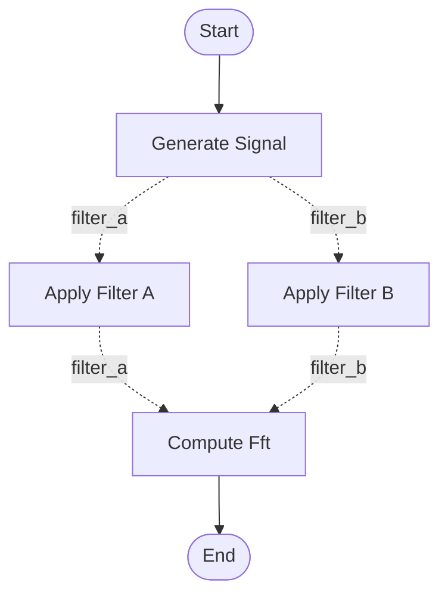

```mermaid
flowchart TD
    start([Start])
    node1[Generate Signal]
    start --> node1
    node2[Apply Filter A]
    node1 -.-> |filter_a| node2
    node3[Apply Filter B]
    node1 -.-> |filter_b| node3
    node4[Compute Fft]
    node2 -.-> |filter_a| node4
    node3 -.-> |filter_b| node4
    node5([End])
    node4 --> node5
```
