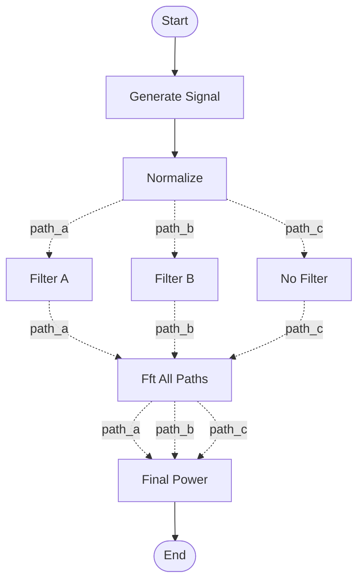

```mermaid
flowchart TD
    start([Start])
    node1[Generate Signal]
    start --> node1
    node2[Normalize]
    node1 --> node2
    node3[Filter A]
    node2 -.-> |path_a| node3
    node4[Filter B]
    node2 -.-> |path_b| node4
    node5[No Filter]
    node2 -.-> |path_c| node5
    node6[Fft All Paths]
    node3 -.-> |path_a| node6
    node4 -.-> |path_b| node6
    node5 -.-> |path_c| node6
    node7[Final Power]
    node6 -.-> |path_a| node7
    node6 -.-> |path_b| node7
    node6 -.-> |path_c| node7
    node8([End])
    node7 --> node8
```
