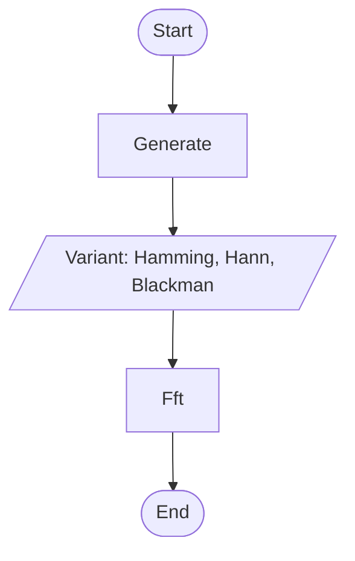

```mermaid
flowchart TD
    start([Start])
    node1[Generate]
    start --> node1
    node2[/Variant: Hamming, Hann, Blackman/]
    node1 --> node2
    node3[Fft]
    node2 --> node3
    node4([End])
    node3 --> node4
```
